# Домашнее задание к занятию «Продвинутые методы работы с Terraform»

### Задание 1
- ```sudo nginx -t```
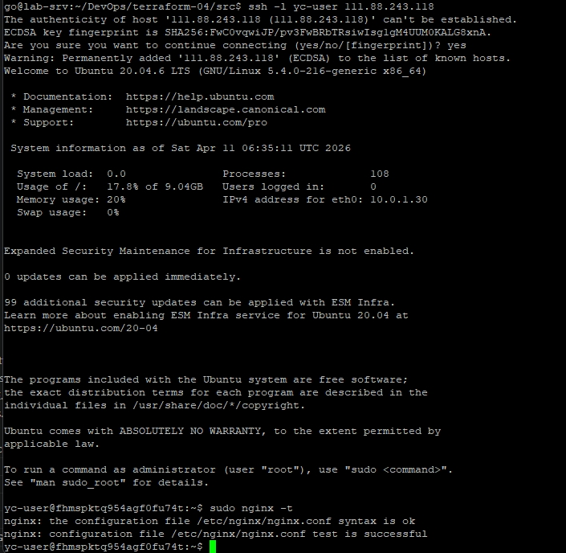
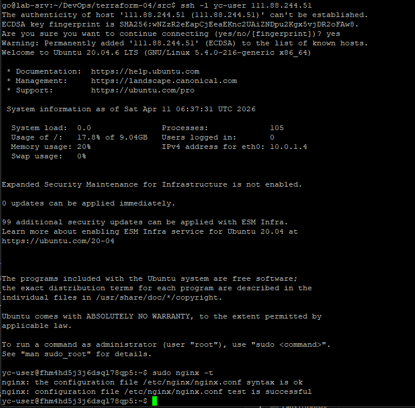
- скриншот консоли ВМ yandex cloud с их метками
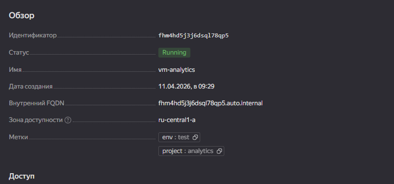
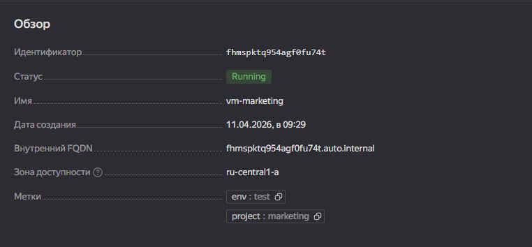
- ```terraform console```

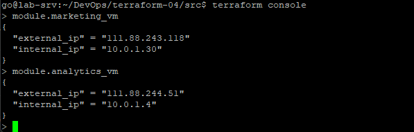

### Задание 2
- ```terraform console```

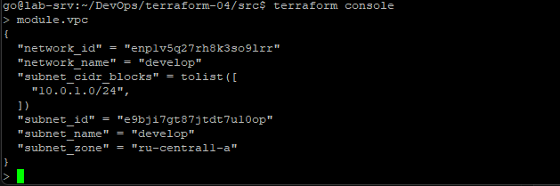
- [документация к модулю с помощью terraform-docs](src/modules/vpc/README.md)

### Задание 3
1. Вывод списка ресурсов в стейте
   - ```terraform state list```
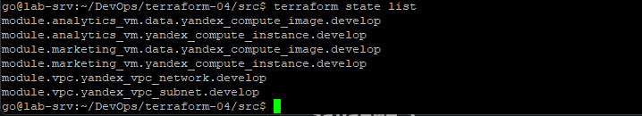
2. Полное удаление модулей из стейта
   - ```terraform state rm module.vpc```
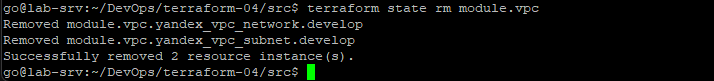
   - ```terraform state rm module.marketing_vm```
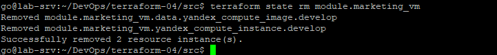
   - ```terraform state rm module.analytics_vm```
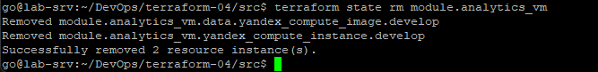
3. Импорт ресурсов обратно:
   - Получение ID ресурсов:
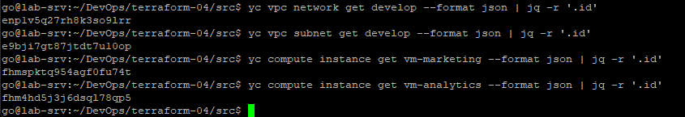
   - Импорт сети и подсети (модуль vpc)
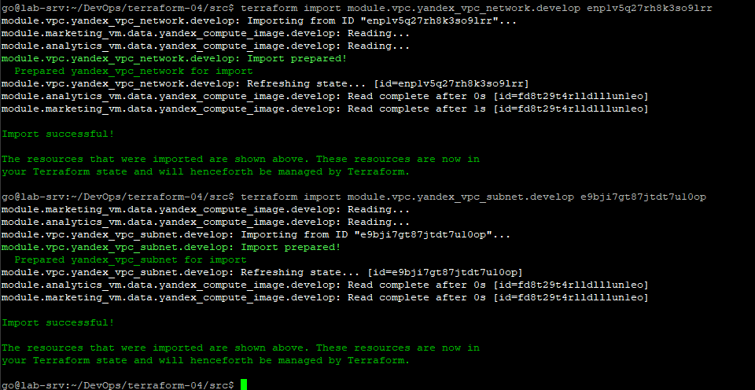
   - Импорт ВМ (модули marketing_vm и analytics_vm)
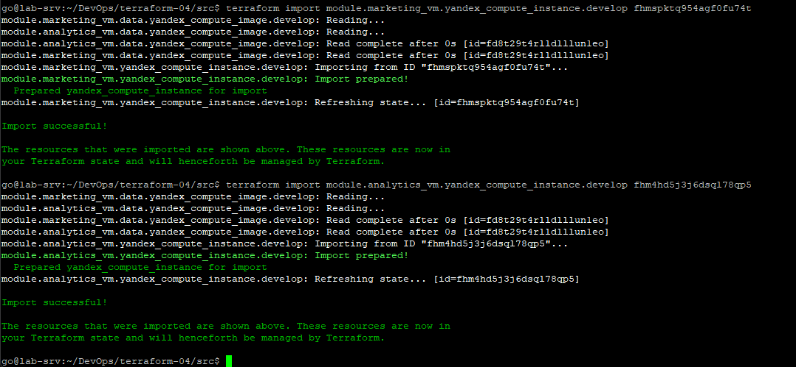
   - Проверка ```terraform plan```
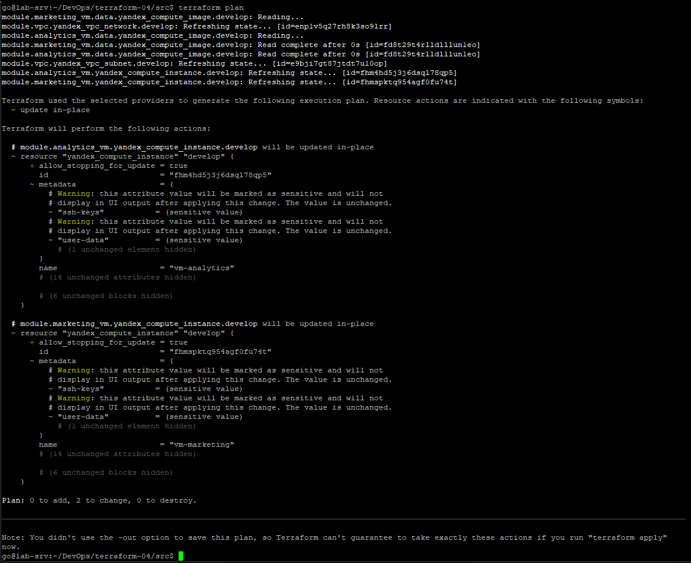