# Домашнее задание к занятию «Использование Terraform в команде»

### Задание 1
1. Проверка кода с помощью tflint
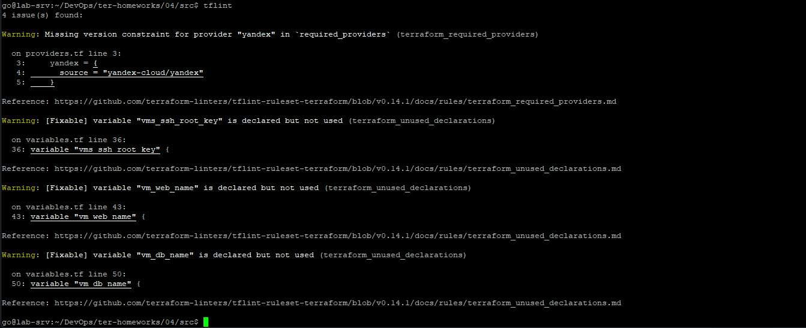
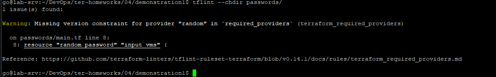
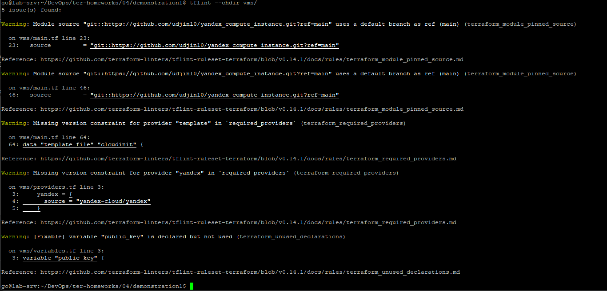

    Типы предупреждений/ошибок:
      - terraform_required_providers
      - terraform_unused_declarations
      - terraform_module_pinned_source

2. Проверка кода с помощью checkov (локальный запуск или через docker, Checkov не может подключиться к API Prisma Cloud (api0.prismacloud.io) для загрузки маппингов и руководств)
   - ```checkov -d .   --framework terraform   --download-external-modules true   -o json > checkov-report.json```
   - ```docker run --rm  -v "$(pwd):/tf" bridgecrew/checkov -d /tf  --download-external-modules true  -o json > checkov-report.json ```

    Типы предупреждений/ошибок:
      - CKV_TF_1
      - CKV_TF_2
      - CKV_YC_2
      - CKV_YC_11

### Задание 2
1. Создаем ветку 'terraform-05' в ветке 'terraform-04'

2. Настраиваем remote state с встроенными блокировками:
    - S3 bucket в Yandex Cloud для хранения state
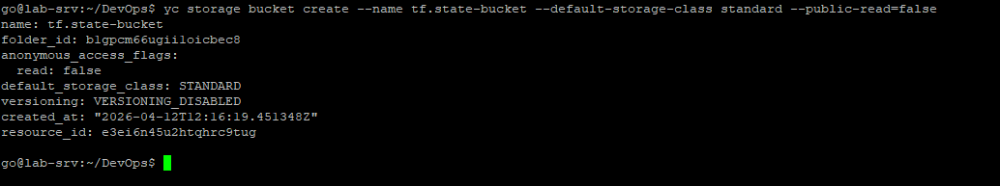
    - service account с правами на чтение/запись в bucket
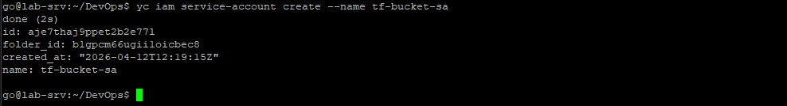
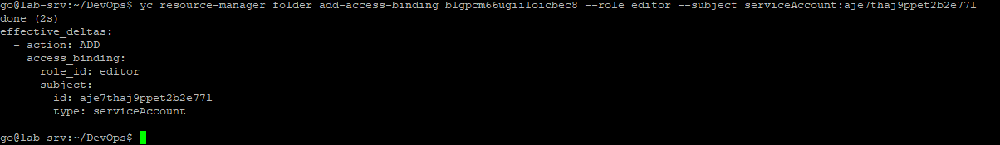
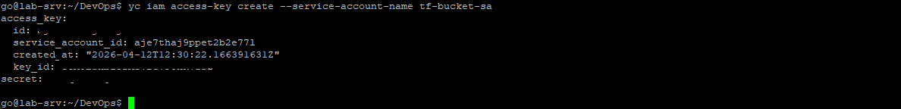
    - [backend в providers.tf с использованием нового механизма блокировок](src/providers.tf)
    - `terraform init -migrate-state`
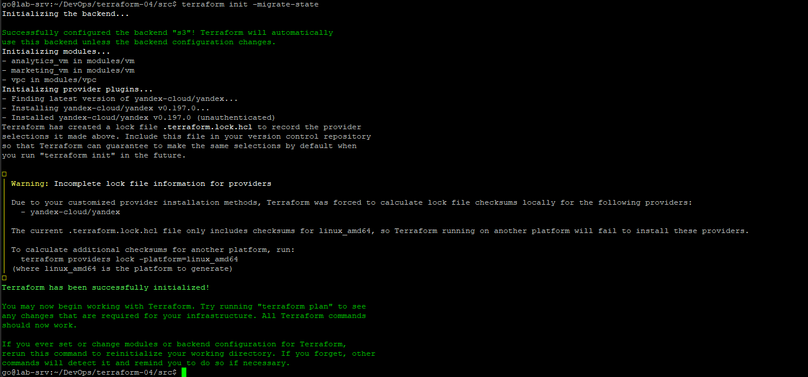
3. Коммит в ветку 'terraform-05' все изменения.
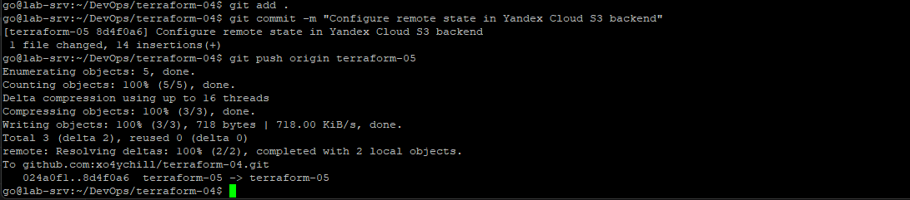
5. Ответ об ошибке доступа к state (блокировка должна сработать автоматически)
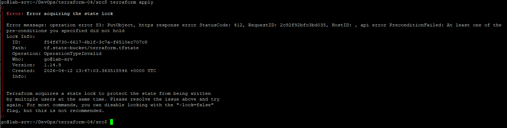
6. Принудительная разблокировка state командой `terraform force-unlock <LOCK_ID>`
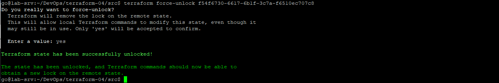

### Задание 3 
